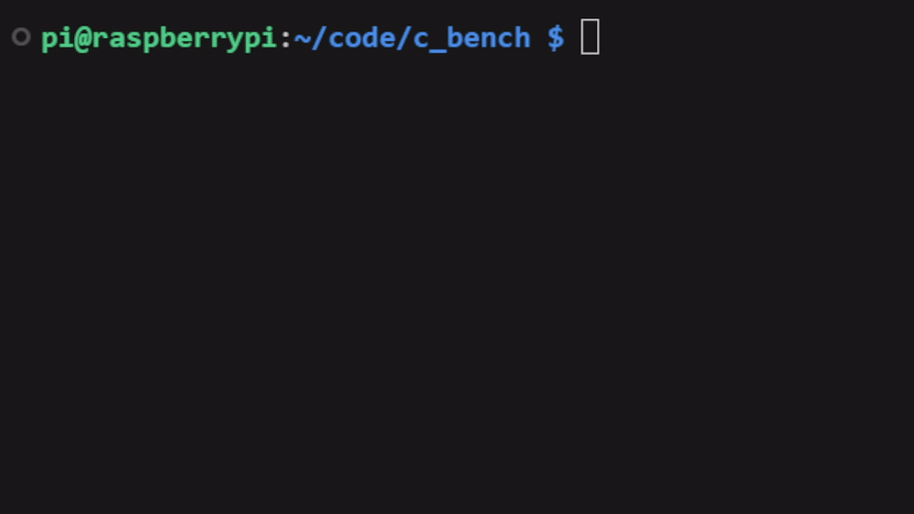

# 🏃‍♂️ C Bench

This is a single and multi-threaded benchmark made in the C programming language that is easy to use.

## 📺 Demo



## ❓ Usage

To compile c bench, run the following command:

```bash
make
```

To run c bench, run the following command:

```bash
./bin/c_bench
```

## 📜 Dependencies

To compile c bench, you need to have the following dependencies installed:

- [GCC](https://gcc.gnu.org/)
- [GNU Make](https://www.gnu.org/software/make/)

## 📝 License

This project is licensed under the GPL-3.0 License - see the [LICENCE](LICENCE) file for details
